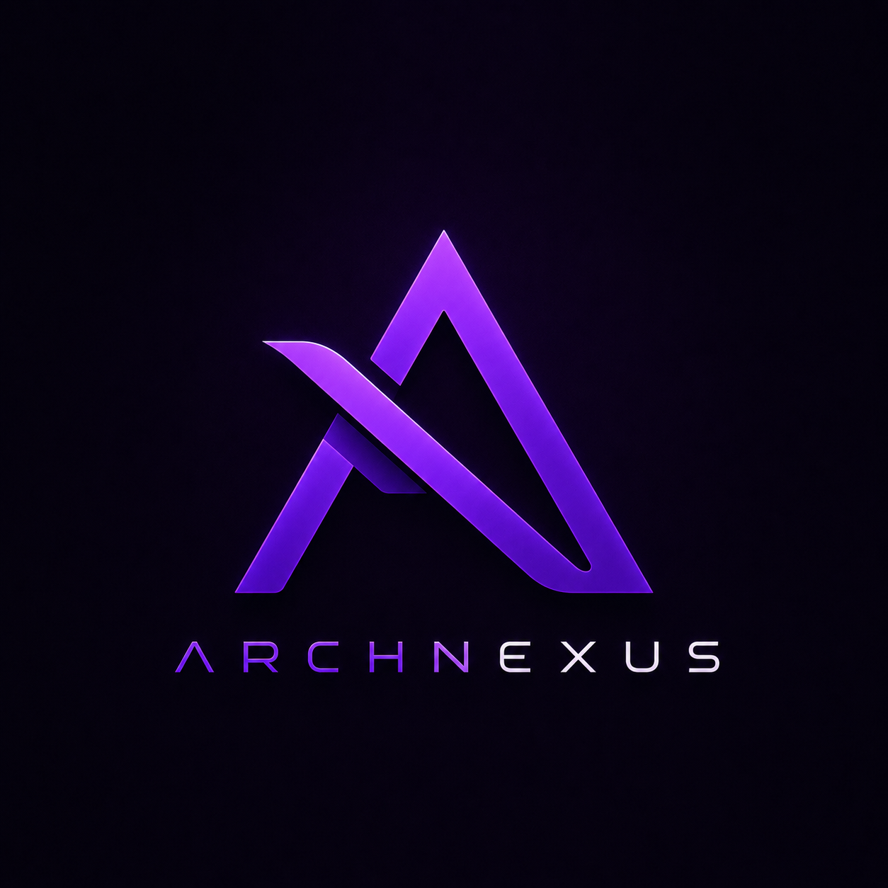

<div align="center">



# ARCHNEXUS — Sistema de Gestão Comercial

**ERP & Ponto de Venda (PDV) Premium**  
*Backend .NET 10 · React 19 · PostgreSQL · App Desktop Windows*

[](https://dotnet.microsoft.com/)
[](https://react.dev/)
[](https://www.postgresql.org/)
[](https://www.docker.com/)

O **ARCHNEXUS** é uma solução completa e escalável para automação comercial. Desenvolvido com foco na experiência do usuário e performance, ele oferece um PDV rápido, gestão de estoque inteligente e um dashboard financeiro rico, tudo envolvido em uma interface de usuário moderna estilo *Glassmorphism*.

[🚀 Acessar Demonstração Web](#-rodar-localmente) · [📦 Download Desktop](#) · [📖 Documentação (Scalar)](#-endpoints)

</div>

---

## ✨ Principais Funcionalidades

- **🛒 PDV Ágil:** Interface focada em produtividade. Suporte a múltiplos pagamentos, cálculo automático de troco e cancelamento de vendas com estorno de estoque em tempo real.
- **📦 Gestão de Estoque:** Controle de produtos por SKU/Código de barras, níveis mínimos de estoque, alertas automáticos e logs detalhados de movimentação (`InventoryMovement`).
- **📊 Dashboard Premium:** Gráficos interativos com vendas retroativas, resumo financeiro, top produtos e KPIs cruciais para a tomada de decisão.
- **🔒 Segurança & Auth:** Autenticação via JWT Bearer com Refresh Tokens rotativos, senhas usando BCrypt (work factor 11), controle de acesso baseado em Roles (RBAC) e Rate Limiting.
- **🖥️ Multi-Plataforma:** Acesse via WebApp (Navegador) ou através do nosso executável nativo Windows otimizado.

---

## 🚦 Status de Desenvolvimento

| Módulo / Feature | Status |
|------------------|:------:|
| Modelagem de Domínio (15 entidades) | ✅ |
| Autenticação (JWT + Refresh + RBAC) | ✅ |
| Frente de Caixa (Vendas, Troco, Locks) | ✅ |
| Estoque, Categorias & Fornecedores | ✅ |
| Relatórios & Dashboard Analítico | ✅ |
| UI/UX Premium (Glassmorphism & Animações) | ✅ |
| Testes Automatizados (xUnit) | ✅ |
| Docker & CI/CD (GitHub Actions) | ✅ |

---

## 🧱 Stack Tecnológica

<details>
<summary><b>Backend (C# / ASP.NET Core)</b></summary>
<br>

- **Framework:** ASP.NET Core 10 (Minimal APIs)
- **ORM:** Entity Framework Core 10
- **Bancos:** PostgreSQL (Produção/Default) com fallback automático para SQLite (Desenvolvimento/Demonstração)
- **Segurança:** BCrypt.Net, JWT Bearer
- **Testes:** xUnit, SQLite in-memory

</details>

<details>
<summary><b>Frontend (React / TypeScript)</b></summary>
<br>

- **Core:** React 19 + TypeScript + Vite
- **Estado & Fetching:** Zustand (Global) + React Query + Axios
- **Roteamento:** React Router DOM
- **Estilização:** CSS Custom Properties + UI Moderna (Inter Font, Animações Suaves, Glassmorphism)

</details>

---

## 🚀 Como Rodar o Projeto

O projeto foi configurado para ser o mais simples possível de iniciar. 

### Opção 1: Via Docker (Recomendado para Avaliação)

A maneira mais fácil de subir toda a stack (Banco, Backend e Frontend) de uma só vez usando nosso `docker-compose.prod.yml`:

```bash
# 1. Clone o repositório
git clone https://github.com/Kaua-KGzin/System-PVD.git
cd System-PVD

# 2. Suba a aplicação (fará o build multi-stage automaticamente)
docker compose -f docker-compose.prod.yml up --build -d
```
> Acesse: **http://localhost:8080**
> 
> *Dica: O banco já é populado automaticamente com produtos, categorias e 30 dias de histórico de vendas na primeira execução! Basta clicar no botão "Acessar Demo" na tela de login.*

### Opção 2: Desenvolvimento Local

Se você quer rodar para desenvolver ou testar:

**1. Pré-requisitos:** .NET 10 SDK, Node.js 20+

**2. Backend:**
```bash
cd Archlab.Backend
dotnet run
```
*(Se não houver PostgreSQL na máquina, ele usará SQLite localmente de forma transparente).*

**3. Frontend:**
```bash
cd frontend
npm install
npm run dev
```

O Vite faz proxy `/api → http://localhost:5235` automaticamente.

### 4. Testes
```bash
dotnet test Archlab.Backend.Tests
```
```
*(Acesse `http://localhost:5173` - o Vite já faz proxy automático para a API).*

> Os testes de concorrência e de busca rodam sobre SQLite, que serializa escritas por conta
> própria e cuja cláusula `LIKE` já ignora maiúsculas. Eles provam a lógica sob interleaving,
> não o comportamento sob contenção real no PostgreSQL — as linhas `[InlineData("PostgreSQL")]`
> em `SaleConcurrencyTests` existem para serem ligadas quando houver uma instância disponível.

---

## 📡 Endpoints (Visão Geral)

A documentação completa da API (OpenAPI) fica disponível em `/openapi/v1.json` e pode ser visualizada via Scalar UI na raiz quando em modo Development. Algumas rotas principais:

- `POST /api/auth/login` — Autenticação e JWT
- `GET /api/products` — Catálogo (suporta `search`, paginação, `lowStock`)
- `POST /api/sales` — Registrar venda no PDV
- `GET /api/dashboard` — Coleta de KPIs e receita diária

---

## 🔒 Considerações Técnicas e Segurança

- **Resiliência no PDV:** O endpoint de fechamento de venda (`Sale`) utiliza mecanismos de bloqueio (*serializable transactions/locks*) para garantir que a concorrência na geração do número da nota e baixa de estoque não gere inconsistências.
- **Fiscal:** A emissão de NFC-e atualmente é um mock técnico para fins arquiteturais.
- **Seeder Inteligente:** O sistema bloqueia a senha de testes em ambiente de Produção e aceita configurações flexíveis de banco via variáveis de ambiente.

---

## ⚙️ Configuração

Além das variáveis de `.env.example`, uma chave merece atenção:

| Chave | Env var | Default | Para que serve |
|-------|---------|---------|----------------|
| `Reports:TimeZone` | `Reports__TimeZone` | `America/Sao_Paulo` | Fuso da loja, em id IANA. |

Relatórios de receita por dia, vendas por hora e o card "vendas de hoje" do dashboard colapsam
um instante em um dia de calendário ou em uma hora — e isso só significa alguma coisa no fuso em
que a loja fecha o caixa. O contêiner não tem fuso configurado (roda em UTC), então **sem essa
chave uma venda das 21h em São Paulo é contabilizada no dia seguinte**. Se o id não for
reconhecido pelo host, o fallback é UTC — nunca o fuso da máquina, que faria o mesmo dado
produzir números diferentes em produção e na máquina do dev.

---

## 🔒 Segurança

- JWT com refresh tokens rotativos (revogação por token)
- Senhas com BCrypt (work factor 11)
- Rate limiting por IP
- CORS configurável por ambiente
- Seeder recusa senha padrão `admin123` fora de Development

> **Fiscal:** A emissão NFC-e é uma **simulação técnica**. Para uso real: certificado digital A1/A3, integração com SEFAZ, regras tributárias por estado/regime.

---

<div align="center">

Feito com 💜 por **Kauã** ([@Kaua-KGzin](https://github.com/Kaua-KGzin))  
*Transformando código em soluções de impacto.*

</div>
